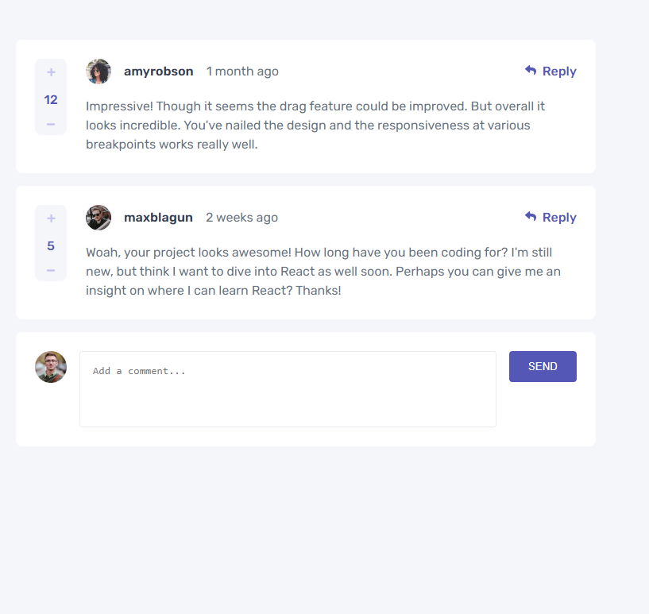

# Seção de comentários interativos

## Índice

- [Visão geral](#visão-geral)
  - [O desafio](#o-desafio)
  - [Captura de tela](#captura-de-tela)
  - [Links](#links)
- [Meu processo](#meu-processo)
  - [Construído com](#construído-com)
  - [O que aprendi](#o-que-aprendi)
  - [Desenvolvimento contínuo](#desenvolvimento-contínuo)
  - [Referências](#referências)
- [Autor](#autor)


## Visão geral

### O desafio

Os usuários devem ser capazes de:

- [x] Veja o layout ideal para o aplicativo, dependendo do tamanho da tela do dispositivo
- [x] LocalStorage para salvar o estado atual no navegador que persiste quando o navegador é atualizado.
- [x] Criar, ler, atualizar e excluir comentários 

### Captura de tela




### Links

- Deploy :

## Meu processo

### Construído com

- Marcação HTML5 semântica
- CSS
- Flexbox
- Grid
- javaScript vanilla
  
### O que eu aprendi

>> Html - > A tag template por default mantém o conteúdo oculto

```html
<template> Olá </template>
```
>> Envia conteúdo para armazenamento da pagina  e exibe ao carregar
```js
  document.addEventListener ("DOMContentLoaded", function () {
	if (!localStorage.getItem("dados")) {
		localStorage.setItem("dados", JSON.stringify(data));
	}})
```
>> Metodo cloneNode -> clona toda a subarvore, incluindo nós filhos.
```js
	var commentNode = template.content.cloneNode(true);
	commentNode.querySelector(".usr-name").textContent = element.user.username;

```
>> Gera um id dinâmico
```js
function uuid() {
		// Retorna um número randômico entre 0 e 15.
		function randomDigit() {
			// Se o browser tiver suporte às bibliotecas de criptografia, utilize-as;
			if (crypto && crypto.getRandomValues) {
				// Cria um array contendo 1 byte:
				var rands = new Uint8Array(1);

				// Popula o array com valores randômicos
				crypto.getRandomValues(rands);

				// Retorna o módulo 16 do único valor presente (%16) em formato hexadecimal
				return (rands[0] % 16).toString(16);
			} else {
				// Caso não, utilize random(), que pode ocasionar em colisões (mesmos valores
				// gerados mais frequentemente):
				return ((Math.random() * 16) | 0).toString(16);
			}
		}
```

### Desenvolvimento contínuo

 <p>Consumo de api -> HTTP: GET, POST, PUT, PATCH, DELETE.</p>


### Referências

- [W3c](https://www.w3schools.com/)
- [Stackoverflow](https://stackoverflow.com/)
- [JavaScript](https://developer.mozilla.org/pt-BR/docs/Web/JavaScript)

## Autor
[Edilane Silva](https://www.linkedin.com/in/edilane-silva/)
